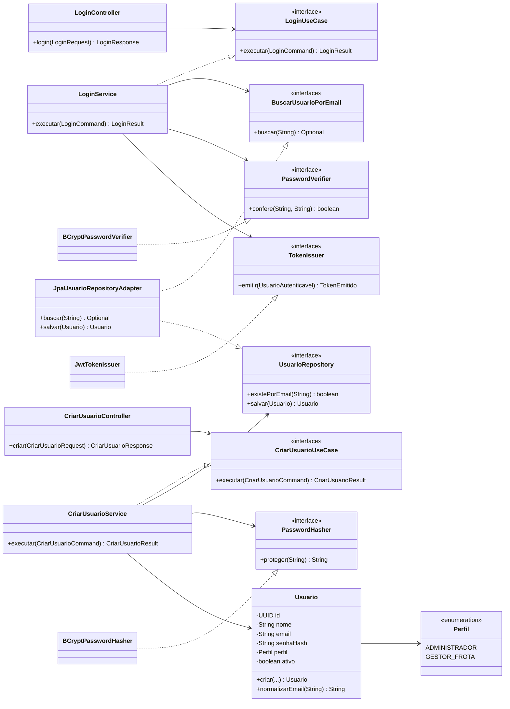

# Diagrama de classes do backend

O diagrama apresenta as classes centrais das fatias `login` e `criar usuário`. As interfaces representam portas; os adapters tecnológicos dependem delas.

```mermaid
classDiagram
direction LR

class LoginController {
  +login(LoginRequest) LoginResponse
}
class LoginUseCase {
  <<interface>>
  +executar(LoginCommand) LoginResult
}
class LoginService {
  +executar(LoginCommand) LoginResult
}
class BuscarUsuarioPorEmail {
  <<interface>>
  +buscar(String) Optional
}
class PasswordVerifier {
  <<interface>>
  +confere(String, String) boolean
}
class TokenIssuer {
  <<interface>>
  +emitir(UsuarioAutenticavel) TokenEmitido
}

class CriarUsuarioController {
  +criar(CriarUsuarioRequest) CriarUsuarioResponse
}
class CriarUsuarioUseCase {
  <<interface>>
  +executar(CriarUsuarioCommand) CriarUsuarioResult
}
class CriarUsuarioService {
  +executar(CriarUsuarioCommand) CriarUsuarioResult
}
class UsuarioRepository {
  <<interface>>
  +existePorEmail(String) boolean
  +salvar(Usuario) Usuario
}
class PasswordHasher {
  <<interface>>
  +proteger(String) String
}
class Usuario {
  -UUID id
  -String nome
  -String email
  -String senhaHash
  -Perfil perfil
  -boolean ativo
  +criar(...) Usuario
  +normalizarEmail(String) String
}
class Perfil {
  <<enumeration>>
  ADMINISTRADOR
  GESTOR_FROTA
}

class JpaUsuarioRepositoryAdapter {
  +buscar(String) Optional
  +salvar(Usuario) Usuario
}
class BCryptPasswordVerifier
class BCryptPasswordHasher
class JwtTokenIssuer

LoginController --> LoginUseCase
LoginService ..|> LoginUseCase
LoginService --> BuscarUsuarioPorEmail
LoginService --> PasswordVerifier
LoginService --> TokenIssuer

CriarUsuarioController --> CriarUsuarioUseCase
CriarUsuarioService ..|> CriarUsuarioUseCase
CriarUsuarioService --> UsuarioRepository
CriarUsuarioService --> PasswordHasher
CriarUsuarioService --> Usuario
Usuario --> Perfil

JpaUsuarioRepositoryAdapter ..|> BuscarUsuarioPorEmail
JpaUsuarioRepositoryAdapter ..|> UsuarioRepository
BCryptPasswordVerifier ..|> PasswordVerifier
BCryptPasswordHasher ..|> PasswordHasher
JwtTokenIssuer ..|> TokenIssuer
```

