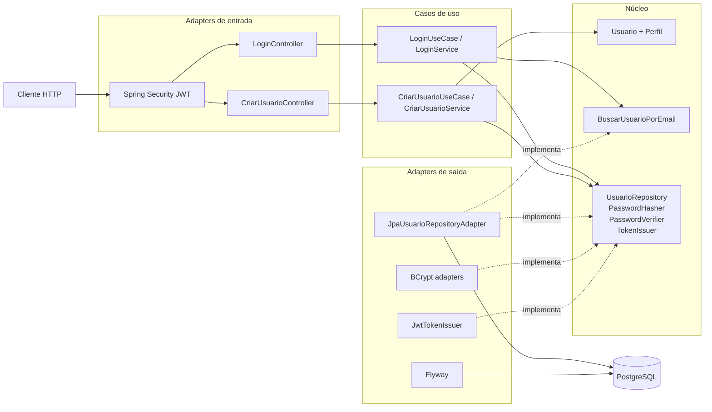

# Diagrama de componentes do backend

As setas acompanham o fluxo de execução. A dependência de código aponta para as portas internas: os adapters implementam interfaces da aplicação ou da API pública do módulo.

